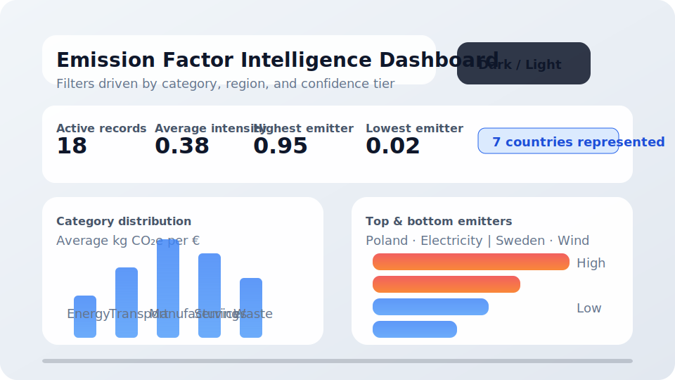
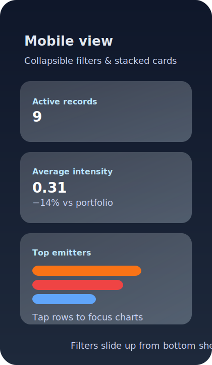

# Emission Factor Dashboard

An interactive React experience for exploring emission factor data. It ships as part of the portable package in the [`dashboard/`](../dashboard) directory and can run as a standalone static site or be embedded inside a larger product.



## Features at a glance

- **Rich filtering** – slice the catalogue by category, region, tier, and free-text search.
- **Selection-driven insights** – highlight one or more table rows to focus the charts and summary statistics.
- **Visual storytelling** – bar charts show distribution by category and the highest/lowest emitters within the active slice.
- **Responsive and themed** – works beautifully on mobile, tablets, and desktops with a built-in dark/light toggle.
- **Graceful fallbacks** – empty states, unknown emission factors, and long activity names are all handled without breaking layout.

## Project structure

```
dashboard/
├── index.html                # entry point served by Vite
├── package.json              # isolated dashboard dependencies
├── src/
│   ├── App.tsx               # theme + layout shell
│   ├── components/           # UI building blocks (charts, filters, table)
│   ├── data/emissionFactors.ts# mocked dataset (swap with API/CSV)
│   ├── hooks/useDashboardState.ts
│   ├── styles/global.css     # tokens + responsive styling
│   └── utils/                # formatting + Chart.js registration helpers
└── vite.config.ts            # tooling configuration
```

## Getting started locally

```bash
cd dashboard
npm install
npm run dev
```

The dev server runs at <http://localhost:5173/> by default. The UI automatically reloads when you edit files.

### Building for production

```bash
npm run build
npm run preview # optional smoke test
```

The final assets live in `dashboard/dist` and can be copied to any static host (Netlify, Vercel, CloudFront, GitHub Pages, etc.).

## Wiring in your own data

The dashboard currently consumes the curated sample in [`src/data/emissionFactors.ts`](../dashboard/src/data/emissionFactors.ts). Replace this module with a fetch call, CSV ingestion, or a GraphQL query.

Example: fetching from a REST API that returns the same shape as `EmissionFactorRecord`.

```tsx
// src/data/emissionFactors.ts
import { useEffect, useState } from 'react';
import type { EmissionFactorRecord } from '../types';

export function useEmissionFactors() {
  const [records, setRecords] = useState<EmissionFactorRecord[]>([]);

  useEffect(() => {
    fetch('/api/emission-factors')
      .then((response) => response.json())
      .then((payload) => setRecords(payload.records));
  }, []);

  return records;
}
```

Then update `Dashboard.tsx` to call the hook instead of importing the static array.

## Customisation ideas

| Area | What to tweak | Hints |
|------|---------------|-------|
| Cards | Add more summary metrics | Calculate additional aggregates (e.g. spend, emissions) and pass them to `SummaryCards`. |
| Charts | Overlay benchmarks | Add extra datasets to `DistributionChart` (e.g. global average or science-based targets). |
| Themes | Apply brand colours | Adjust CSS variables in `src/styles/global.css`. Use `data-theme` to add more palettes. |
| Table | Export functionality | Extend `EmissionTable` with an “Export selection” button that serialises `selectedIds`. |
| Tooltips | Richer context | Update `formatRecordLabel` and chart tooltip callbacks to include supplier examples or year. |

## Accessibility & usability notes

- All interactive controls (filters, theme toggle, table rows) have focus styles and descriptive labels.
- Keyboard users can tab through the dashboard, and the table highlights the active row.
- Charts rely on colour *and* text (legend titles, tooltips) to distinguish values.
- Long text is truncated with tooltips so important details are still discoverable.

## Screenshots

- Desktop: 
- Mobile: 

## Next steps

- Hook up real emissions, spend, or supplier enrichment data for deeper analysis.
- Drop the build output into your analytics portal or deliver it as part of customer onboarding.
- Instrument the dashboard with analytics (Amplitude, PostHog) to understand which filters matter most to users.
